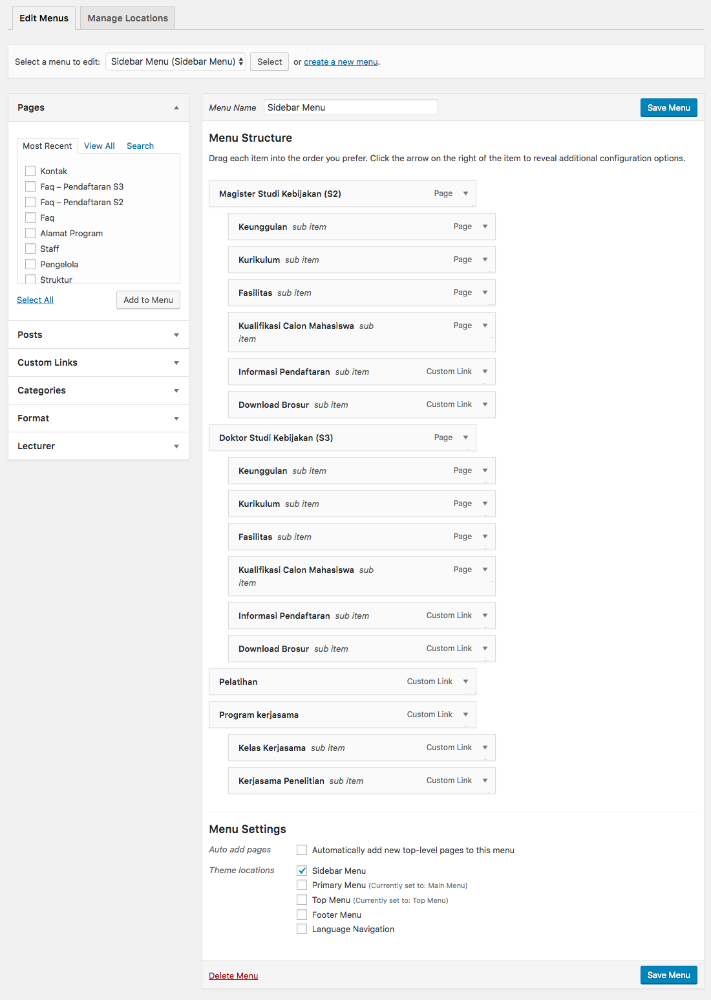
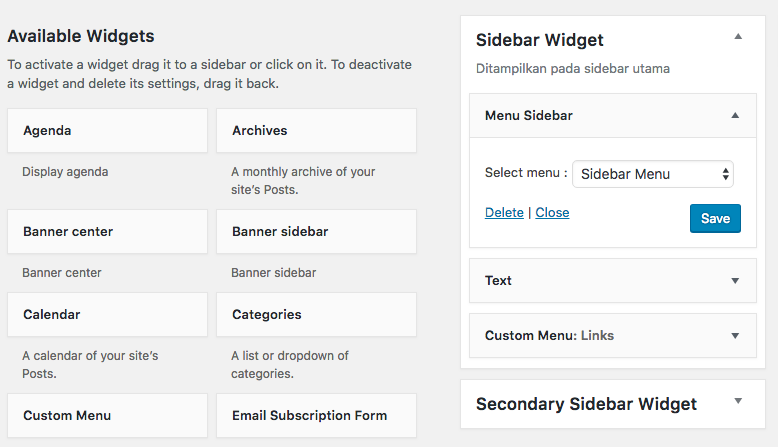

# Wordpress Plugin : obay sidebar menu
### Wordpress plugin to make sidebar menu widget

How to use :
1. Install the plugin to wordpress
1. Goto **Appearances > Menus > create a new menu**
    
1. Goto **Appearances > Widgets > search Sidebar Menu widget > Choose menu > Save**
    
1. See the result
    
